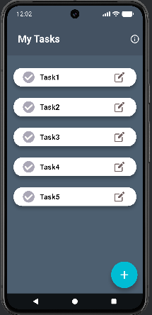

# 📝 To-Do List App

A simple and elegant **Flutter To-Do List application** that helps users manage daily tasks with features like **adding, editing, checking, and deleting tasks**.  
The app uses a dark theme for a modern look and smooth user experience.

---

## 🚀 Features

✅ Add new tasks  
✏️ Edit existing tasks using a dialog box  
❌ Delete tasks by swiping left  
☑️ Mark tasks as completed (check/uncheck functionality)  
🗑️ Automatically removes a task when swiped  
ℹ️ Info page navigation using the AppBar icon  
📋 Empty state UI with illustration when no tasks are available

---

## 🎨 App Preview


> *(Add screenshots from your app in the `assets/screenshots/` folder and name them accordingly)*

---

## 🧩 Tech Stack

- **Language:** Dart
- **Framework:** Flutter
- **UI Widgets:** Material Design
- **IDE:** VS Code / Android Studio

---

## 📁 Folder Structure

```bash
lib/
│
├── main.dart # Entry point of the app
├── end.dart # Info page
└── assets/
└── images/
├── check.png
├── uncheck.png
├── edit.png
├── unedit.png
└── clipboard.png
```


---

## ⚙️ How It Works

### 🏠 Home Screen
- Displays a list of all tasks.
- Each task has:
    - A checkbox icon (check/uncheck).
    - An edit button to modify the task name.
    - Swipe-to-delete functionality.

### ➕ Add a Task
Click the **floating "+" button** to add a new task named “new task”.

### ✏️ Edit a Task
Tap the **edit icon** next to a task.  
An alert dialog will appear allowing you to rename the task.

### ✅ Mark as Complete
Tap the checkbox to mark a task as complete (adds a line-through effect).

### 🗑️ Delete a Task
Swipe a task to the right to delete it permanently.

### ℹ️ Info Page
Tap the **info icon** in the top-right corner of the AppBar to navigate to the info page (`end.dart`).

---

## 🧠 Concepts Used

- **Stateful Widgets** for dynamic UI updates
- **ListView.separated()** for structured task listing
- **Dismissible Widget** for swipe-to-delete functionality
- **showDialog()** for task editing popup
- **List Manipulation** (add, edit, remove tasks dynamically)
- **setState()** for rebuilding widgets upon state change

---

## ⚡ Getting Started

### 1️⃣ Clone the repository
```bash
git clone https://github.com/yourusername/todo_list_app.git
```

### 2️⃣ Navigate to the project directory
```bash
cd todo_list_app
```

### 3️⃣ Get dependencies
```bash
flutter pub get
```

### 4️⃣ Run the app
```bash
flutter run
```
---
### 📸 Screenshots
You can capture your emulator screenshots and store them under:
---

---
## Contributing

Contributions are welcome! Feel free to fork the project and submit pull requests.

---

## License

This project is licensed by Akshay And made with ❤️ in  India.
 